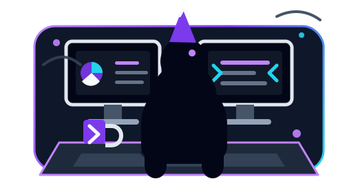

<!-- Header Capsule Banner -->

  

<!-- Contact Badges -->

  
  
  
  

## About

- I enjoy building practical software and learning by turning ideas into working projects.
- Comfortable moving between frontend, backend, mobile, scripting, and systems fundamentals.
- Curious about clean architecture, distributed systems, browser tooling, and useful developer-facing products.
- Reach me at **aryanawasthi1974@gmail.com**.

 

 

## Tech Stack

  
  
  
  
  
  
  
  
  
  
  
  
  
  
  
  
  
  
  
  

 

## Featured Projects

<table width="100%">
  <tr>
    <td width="50%" valign="top">
      <h3 align="center">Detoxify</h3>
      

        A Chrome Manifest V3 extension and Node.js backend that replaces YouTube's default home feed with a personalized, distraction-free learning feed.
      

      

        
        
        
        
        
      

      

        
      

    </td>
    <td width="50%" valign="top">
      <h3 align="center">Campus P2P File Distribution</h3>
      

        A LAN-focused peer-to-peer file sharing system with tracker-based discovery, custom TCP piece exchange, SHA-256 verification, resumable manifests, and a React dashboard.
      

      

        
        
        
        
        
      

      

        
      

    </td>
  </tr>
  <tr>
    <td width="50%" valign="top">
      <h3 align="center">Healthcare App</h3>
      

        A native Android healthcare prototype with login/register, doctor discovery, appointment booking, medicine ordering, lab-test booking, carts, order history, and health articles.
      

      

        
        
        
        
      

      

        
      

    </td>
    <td width="50%" valign="top">
      <h3 align="center">web-wonders</h3>
      

        A collection of 22 HTML/CSS/JavaScript projects covering DOM manipulation, browser APIs, API integrations, games, dashboards, algorithms, Canvas visualization, and Canvas animation.
      

      

        
        
        
        
        
      

      

        
      

    </td>
  </tr>
</table>

 

## Project Collections

<table width="100%" align="center">
  <tr>
    <td align="center" width="33%" valign="top">
      <strong>The-Py-Lab</strong> 
      Python utilities for scraping, APIs, encryption, media downloading, image processing, and DFS/BFS pathfinding.
        
      
      
      
      
        
      
    </td>
    <td align="center" width="33%" valign="top">
      <strong>CPP-Craftsmanship</strong> 
      C++ terminal projects covering expression parsing, state machines, game logic, and graph traversal.
        
      
      
      
      
        
      
    </td>
    <td align="center" width="33%" valign="top">
      <strong>Quantum-Computing</strong> 
      Coursework notebooks for qubit visualization, equivalent circuits, quantum adders/subtractors, and tunneling visuals.
        
      
      
      
      
        
      
    </td>
  </tr>
</table>

 

## Contact

  
  
  

<!-- Footer Capsule Banner -->

  

